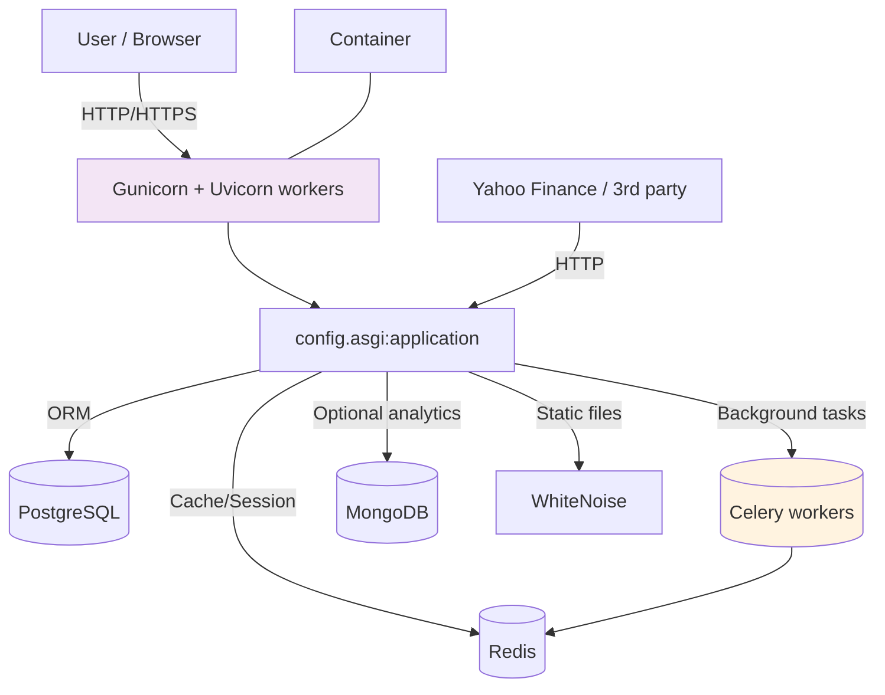

## Summary

Purpose: Document the technology stack, architecture patterns, runtime and deployment details, and recommended conventions for the `personal-finance` repository so new features and maintenance stay consistent and safe.

Primary project type: Python web application (Django) with asynchronous workers (Celery), background/ETL tasks, and a data-focused analytics surface.

Depth: Comprehensive (implementation-ready guidance, diagrams, and recommendations).

## Technology Identification

- Primary language: Python
  - Project Python requirement: >=3.10, <4 (pyproject.toml)
- Web framework: Django (>=5.1.0, <5.2)
- ASGI / async runtime: Uvicorn (uvicorn[standard] present) + Gunicorn using Uvicorn worker class in Dockerfile
- Task queue: Celery (>=5.5.0) with django-celery-beat for scheduled jobs
- API layer: Django REST Framework (djangorestframework>=3.16.0) and drf-spectacular for OpenAPI schema
- Database(s): Primary relational DB: PostgreSQL (psycopg2-binary); fallback SQLite for local/test
- Additional data stores: Redis (caching + Celery broker), MongoDB (pymongo present) for optional data ingestion
- ORM & migrations: Django ORM for app models; SQLAlchemy + Alembic present for additional data pipelines/migration needs
- Frontend/server-side rendering: Django templates + static assets managed with django-compressor and whitenoise; also Dash + Plotly present for interactive analytics pages
- Dev/test & tooling: pytest (pytest-django), ruff (formatter/linter), flake8 referenced in CI, pre-commit hooks enabled
- Packaging/build: setuptools + PEP517 build backend; project packaged as wheel in Docker builder stage
- Containerization: Multi-stage Dockerfile targeting python:3.11-slim-bookworm; non-root runtime user; healthcheck included
- CI/CD: GitHub Actions workflows (CI runs tests, lint, pip-audit), additional PR workflows in repo

## Version & Dependency Highlights (from pyproject.toml)

- Django >=5.1.0,<5.2
- django-environ >=0.12.0 (env file management)
- psycopg2-binary >=2.9.0 (Postgres adapter)
- celery >=5.5.0,<6.0
- django-celery-beat >=2.8.0
- redis >=6.0.0
- djangorestframework >=3.16.0
- uvicorn[standard] >=0.35.0
- pytest >=8.4.2 (testing)
- ruff configured (tool.ruff) with target py311

Note: Many data and analysis libraries are included (pandas, numpy, matplotlib, plotly, scikit-learn, statsmodels, yfinance, etc.) — treat these as optional/feature-specific dependencies and prefer lazy imports in performance-sensitive code paths.

## High-level Architecture



## Project Layout & Conventions

- Source layout: `src/personal_finance/` is the package root; packaging configured via setuptools with `package-dir = {"" : "src"}`.
- Django project config lives under `config/` (settings split into base/test/production)
- Tests live under `tests/` and pytest discovery is configured to `testpaths = tests` in `pytest.ini`.
- Config and environment:
  - Uses `django-environ` (`environ.Env`) to load `.env` when configured.
  - Settings read from env variables (recommended secret management: use a secrets manager in production).
- Static assets: built into `staticfiles/`, served with Whitenoise in container, and `django-compressor` used to compress assets.

## Runtime & Deploy (Docker)

- Dockerfile: multi-stage build
  - Builder stage: creates venv, installs build deps, builds wheel
  - Runtime stage: copies wheel and venv into final image, runs as non-root `appuser`
  - Entrypoint: `/entrypoint.sh` (handles migrations/startup tasks)
  - CMD: `gunicorn --bind 0.0.0.0:8000 --workers 4 --worker-class uvicorn.workers.UvicornWorker config.asgi:application`
  - Healthcheck: HTTP probe against `/health` endpoint on configured port

## CI / Testing

- CI: GitHub Actions (`.github/workflows/ci.yml`) runs a matrix across Python versions (3.10, 3.11), caches pip, installs dependencies, runs a focused flake8 lint step then pytest. pip-audit runs in a separate job.
- Test setup: `tests/conftest.py` sets DJANGO_SETTINGS_MODULE and calls `django.setup()`. CI sets `DATABASE_URL` to an SQLite file for testing.
- Current pytest behavior: a guard in CI treats pytest exit code 5 (no tests collected) specially — consider tightening policy (spike and PoC exists in `spike/pytest-no-tests-poc`).

## Observability & Logging

- Logging configured in `config/settings/base.py` with console handler and a verbose formatter. Ensure production logging sinks (e.g., centralized logging) are added.
- Health endpoint used for container healthcheck; recommend adding application metrics (Prometheus) and request tracing for production.

## Security Considerations

- GITHUB Actions workflows restrict `contents: read` in some workflows; keep minimal token permissions.
- Depend on pip-audit and vulnerability scanning; run regular dependency audits and update pinned constraints.
- Avoid committing secrets; use environment variables or a secrets manager (AWS Secrets Manager, Azure Key Vault, Vault).
- Password hashing uses Argon2 (argon2-cffi present) — good default.
- Database exposure: use private network + managed Postgres, map host ports only for development (current compose maps host port 52135 for Postgres in deploy/portainer changes).

## Data & State

- Primary state is in PostgreSQL; caching and broker in Redis; scheduled tasks in Celery with django-celery-beat storing schedules in the DB.
- There are references to both SQLAlchemy/Alembic and Django migrations — be explicit about which migration tool manages which schema to avoid conflicts.

## Testing & Quality Gates

- Linting: ruff configured (tool.ruff); CI uses flake8 for a focused set of severe rules. Consider standardizing on ruff for linting and auto-formatting.
- Tests: pytest + pytest-django are used. Tests should be deterministic and avoid network calls; use recorded fixtures or dependency stubs for external APIs.

## Recommendations & Best Practices

1. Dependency management
   - Keep a `constraints.txt` and `requirements.txt` for deterministic installs. Use Dependabot or PyUp for automated updates and review.
   - Consider pinning direct deps in a `requirements.lock` for production builds and use constraints only for CI/dev.

2. Secrets & configuration
   - Never commit secrets. Move production secrets to a secrets manager and load at runtime.
   - Add a secrets rotation policy and document environment variables in `deploy/*` docs.

3. CI / Workflow hygiene
   - Enforce test collection detection (PoC implemented) so that `no tests collected` fails CI by default unless explicitly exempted.
   - Centralize linting: prefer ruff for both CI and local formatting; align editorconfig and pre-commit hooks to reduce noise.

4. Runtime & scaling
   - Configure Gunicorn worker tuning (workers = 2 x CPU + 1) and set timeouts; make worker count configurable via env.
   - Use connection pooling for Postgres and tune Celery concurrency based on instance sizes.

5. Observability
   - Add metrics (Prometheus exporters) and structured JSON logs for production. Ensure sensitive fields are redacted.

6. Data migrations
   - Clarify ownership between Django migrations and Alembic/SQLAlchemy usage. Prefer one source of truth per schema unless clearly separated (e.g., separate schema for analytics pipelines).

7. Security
   - Enable automated dependency scanning and fix high/critical findings promptly.
   - Harden Django settings in production: DEBUG=False, secure cookies, HSTS, CSP, and secure session cookie settings.

## Implementation Templates & Examples

### Implementation snippets

Docker deployment snippet (runtime):

```dockerfile
# (See Dockerfile in repository) keep multi-stage pattern and non-root user
```

Healthcheck endpoint recommendation:

```python
from django.http import JsonResponse

def health(request):
   return JsonResponse({"status": "ok"})
```

Minimal pytest CI collection check (PoC exists in `.github/workflows/poc-pytest-collect-check.yml`):

```sh
pytest --collect-only -q | wc -l
```

## Upgrade & Migration Paths

- Django upgrades: Test against minor releases in a separate branch and run full test matrix. Watch for deprecated APIs in Django 5.x.
- Python upgrades: ensure dependencies are compatible with target Python; ruff target-version is py311.

## Roadmap & Next Steps

1. Consolidate migration tooling: decide between Django migrations vs Alembic for SQL-managed schemas.
2. Harden CI by enforcing test collection and standardizing linting on ruff.
3. Add production observability (metrics + log aggregation).
4. Document deployment runbooks for Portainer / Leapcell (deploy/portainer and deploy/leapcell docs exist).

## Appendix

- Key files: `pyproject.toml`, `Dockerfile`, `config/settings/*`, `pytest.ini`, `.github/workflows/ci.yml`, `requirements.txt`, `requirements.lock`, `alembic/`.
- Common commands:

```sh
# Run tests
python -m pytest

# Build image
docker build -t personal_finance:latest .

# Run locally (development)
python run_finance.py
```

---

Generated: 2025-09-23
